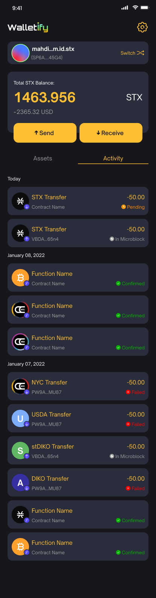

# Overview

A lot of open-source projects start as small point solution initiatives, versus behemoth one-size-fits-all software packages. As a result, these solutions tend to be lightweight, focused, and usually do a pretty good job solving the problem.

Our plan for WISE is to make the product available as an open-source solution for the Stacks community. We genuinely believe it will help developers build more Mobile dApps on top of Bitcoin easily, as well as accelerate the onboarding process for new users.

We appreciate it you send us all your comments and feedback to develop a one-of-a-kind product that will bring great benefit to the community. We’d love to hear from you!

To know more and view our planned milestones, check this [Wise grant](https://github.com/stacksgov/Stacks-Grants/issues/134)

## WISE App iOS/Android

Through WISE you can:

1- Manage your identity

- Authentication.
- Create a new ID.
- Create a new account.
- Recover seed phrase.
- Create and change the username.

2- Manage your assets

- Send and receive STX and BTC.
- Send and receive NFTs.
- Send and receive Fungible tokens on Stacks.
- Stacking pools.
- Delegation.

## Seamless onboarding experience

We came with a solution to ease the user’s journey authenticating through [Stacks BNS](https://docs.stacks.co/build-apps/references/bns). With a single tap the users and dApp developers could access the plethora of potential stacks blockchain features and services, the idea of this authenticator is, The user will login with his wallet one time using WISE, and every time any other apps try to authenticate it will ask the user’s permission to generate the identity for the current usage app, so basically, the flow is:

- The DApp requests the appPrivateKey from WISE
- The user will review the app data within WISE interface and then decide to either grant or reject access request by that app to use any of his currently set up identities on WISE.
- WISE will generate appPrivateKey for the app, once it’s generated it will redirect the user to the app with the required data.

## Scope

Basically, developers who are building dApps will no longer need to use deprecated SDKs, to build their apps on top of Stacks, they will focus on their app journey and not the hassle of creating a better UX for their authentication, and STX transfers and contract interactions in the future.

We will not stop from here, we’re looking further to implement more features for this product, our vision is to make life easier for developers, the second phase of this app is to provide the identities real information which is not found in the current connect ux, such as avatar, full name, social media and more personal information the user will decide what are the information the app asking takes.

Also, we’re planning to implement STX transfer where users will be able to transfer STX from other apps through Wise, and more features.

Why Wise?

- **W** > Wallet: Fully wallet functionality, with a better UX and usage, users will be able to transfer/receive STX, NFTs, and so on
- **I** > Identities: Users will be able to generate new identities, and authenticate with these identities to other apps
- **S** > Stacks: We'll implement Stacks functionalities such as Stacking pool, Delegations, etc..
- **E** > Encryption

## Screenshots

<table style="width:80%">
  <tr>
    <td></td>
    <td></td>
  </tr>
  <tr>
   <td></td>
   <td></td>
  </tr>
</table>
